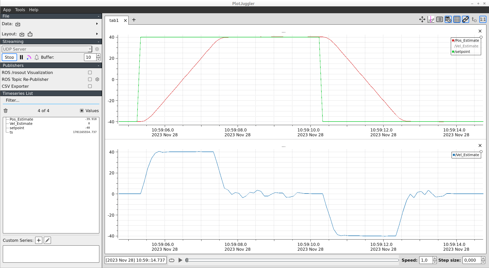

# Plotting live data with Plotjuggler

Containerization is crucial for a reliable CI/CD workflow, but it can be challenging when you need live data visualization, especially for things like tuning motion control.

The good news? There's a simple solution. Just send your data to [Plotjuggler](https://plotjuggler.io/) using a UDP socket. I've included a code example below to show you how it's done. It's straightforward yet still packs in all the features you need for real-time signal visualisation.

Need to stream data quickly? Just use the UDP_Client from the example. With just a few lines of code, you're all set.

!!! note
    This approach of using udp packets is great when you have a single container application and no messaging layer setup. If messaging middleware is being used, like `mqtt` for example, it is better to use mqtt messages in order to avoid functionality duplication. Plotjuggler is capable of handling `mqtt` and `ROS` messages.



<!-- more -->

```python
--8<-- "code/udp_plot.py"
```
