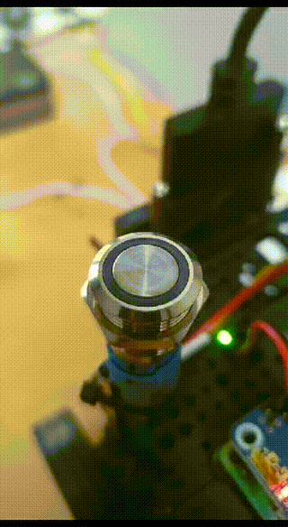

# Effortlessly Add a Heartbeat and Power Button to Your Raspberry Pi




Want to make your Raspberry Pi experience even better with a visible heartbeat and easy shutdown? It's simpler than you think and doesn't even require any software!.

Just connect an LED to GPIO 4 and a momentary push button between GPIO 3 and a ground pin.

Next, tweak your `config.txt` by adding these two lines:

```plaintext
dtoverlay=gpio-led,gpio=4,label=heartbeat-led,trigger=heartbeat
dtoverlay=gpio-shutdown,gpio_pin=3,active_low=1,gpio_pull=up
```

This setup will give you a pulsating heartbeat indicator and a convenient power button.

Reboot your Pi, and voilà! Your Raspberry Pi now has a handy power button and a cool heartbeat indicator, making it more user-friendly, especially for headless operations.
