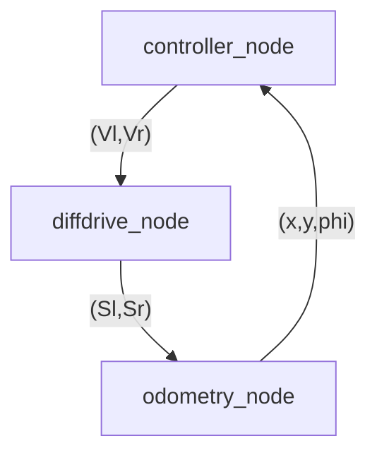
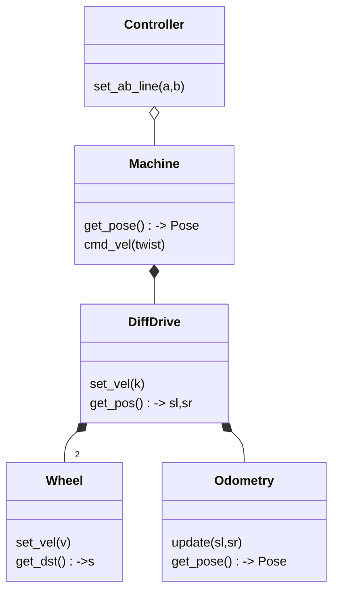

# Basic line follower example

!!! note
    This example is work-in-progress

## Planned

* [ ] demo notebook

## Design

Data flow:

The system consists of 3 nodes:

* **controller** - uses  pure pursuit control algorithm to follow a line along x-axis
* **diffdrive** - simulates a differential drive robot
* **odometry** - keeps track of robot orientation based on dead reckoning

Each node is a class, running its own coroutines.

A class diagram would look like this:

**Note:** we are assuming perfect odometry tracking here. In real world, this is not the case and odometry values are subject to drift. To solve this, sensor fusion techiques are often used like particle filters or Kalman filter.
